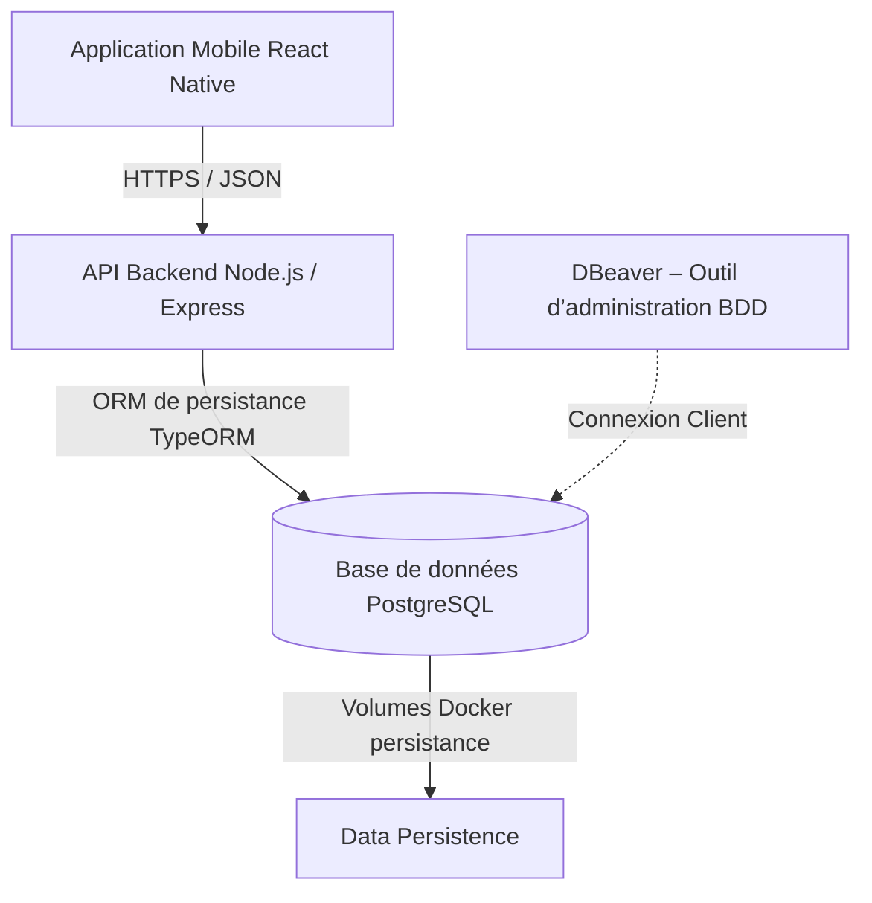

# E-Tagmat - Smart Logistics & Groupage Platform

E-Tagmat is a premium mobile application for managing groupage tenders in the logistics sector. It connects Shippers with Carriers through an automated dispatching system and a high-end mobile experience.

---

# � CAHIER DES CHARGES: ARCHITECTURE TECHNIQUE
**Projet E-Tagmat – Management des chaînes logistiques externalisées**

## 1. Objectif de l’architecture technique
L’architecture technique du projet E-Tagmat a pour objectif de :
- Garantir la fiabilité, la sécurité et la maintenabilité du système
- Assurer la persistance des données
- Faciliter le développement, les tests et le déploiement
- Offrir une architecture professionnelle, prête pour la production

## 2. Vue d’ensemble de l’architecture
L’architecture repose sur une approche client–serveur avec conteneurisation Docker.



## 3. Architecture applicative

### 3.1 Application Mobile (Client)
**Rôle :**
- Interface utilisateur
- Gestion de la navigation (useRouter)
- Authentification (login / logout)
- Interaction avec l’API backend

**Technologies :**
- React Native
- Axios
- useRouter

### 3.2 Backend (Serveur API)
**Rôle :**
- Fournir une API REST sécurisée
- Implémenter la logique métier
- Gérer l’authentification et les autorisations
- Persister les données

**Technologies :**
- Node.js
- Express.js
- Architecture MVC
- JWT

## 4. Architecture MVC du Backend

### 4.1 Model
- Entités TypeORM
- Représentation des tables PostgreSQL
- Gestion des relations (OneToMany, ManyToOne)

### 4.2 Controller
- Réception et traitement des requêtes HTTP
- Validation des données
- Gestion des réponses et erreurs

### 4.3 View
- Non applicable côté backend
- Remplacée par des réponses JSON

## 5. Architecture de persistance des données

### 5.1 ORM utilisé
- **TypeORM** (ORM de persistance)
**Fonctions :**
- Mapping objet–relationnel
- CRUD
- Transactions
- Migrations

### 5.2 Base de données
**SGBD :**
- PostgreSQL
**Persistance :**
- Volumes Docker assurant la conservation des données

### 5.3 Outil de gestion de base de données – DBeaver
**Rôle de DBeaver :**
- Administration et visualisation de la base PostgreSQL
- Exécution de requêtes SQL
- Analyse des données
- Vérification des relations et contraintes
- Outil de debugging et de contrôle

**Utilisateurs :**
- Développeurs
- Administrateurs techniques

📌 *DBeaver est utilisé en dehors des conteneurs, comme outil client se connectant à la base PostgreSQL exposée.*

## 6. Architecture Docker

### 6.1 Principe Client / Daemon
- **Docker Client** : interface de commande utilisée par le développeur
- **Docker Daemon** : moteur d’exécution des conteneurs

### 6.2 Conteneurs du projet
| Conteneur | Rôle |
|-----------|------|
| api | Backend Node.js |
| db | PostgreSQL |
| network | Réseau interne Docker |

### 6.3 Persistance Docker
- Volume Docker pour PostgreSQL
- Données conservées après redémarrage
- Compatible sauvegardes

## 7. Communication entre composants

### 7.1 Mobile ↔ Backend
- HTTPS
- Format JSON
- Authentification JWT

### 7.2 Backend ↔ Base de données
- Connexion TypeORM
- Accès restreint
- Sécurisé via variables d’environnement

### 7.3 DBeaver ↔ Base de données
- Connexion directe PostgreSQL
- Utilisée uniquement pour administration et maintenance

## 8. Sécurité de l’architecture
- Hash des mots de passe (bcrypt)
- JWT avec expiration
- Middleware d’authentification
- Séparation des accès (API / DB)
- Variables sensibles protégées (.env)

## 9. Gestion des erreurs et logs
- Logs applicatifs côté backend
- Messages d’erreur normalisés
- Traçabilité des actions critiques

## 10. Scalabilité et évolutivité
- Architecture modulaire
- Possibilité d’ajout de services
- Intégration future :
  - Notifications
  - Paiement
  - Tracking
  - Statistiques

## 11. Déploiement
**Environnements :**
- Développement
- Préproduction
- Production

**Outils :**
- Docker
- Docker Compose
- DBeaver (administration)

## 12. Bonnes pratiques appliquées
- Séparation claire des responsabilités
- Architecture MVC
- ORM de persistance
- Conteneurisation professionnelle
- Documentation technique

## 13. Résumé exécutif
L’architecture technique du projet E-Tagmat repose sur :
- Une application mobile React Native
- Une API backend Node.js structurée en MVC
- Une base PostgreSQL persistante
- Un ORM TypeORM
- Une infrastructure Docker Client / Daemon

---

# 🛠️ Installation & Démarrage (Guide Pratique)

### 1. Prérequis
- Node.js (v18+)
- Docker (pour PostgreSQL & Redis)
- Application **Expo Go** installée sur votre smartphone.
- **DBeaver** pour l'administration de la BDD.

### 2. Lancement Rapide (Concurrent)
Depuis la racine du projet :
```bash
npm install
npm run dev
```
Cette commande lance le backend et l'application mobile simultanément.

### 3. Lancement Individuel

#### Backend
```bash
cd backend
npm install
# Configurez votre .env avec DB_HOST, DB_USER, DB_PASSWORD, REDIS_HOST, etc.
npm run dev
```

#### Mobile (Expo Go)
```bash
cd frontend/mobile
npm install
npx expo start
```
Une fois lancé, scannez le QR code avec l'application **Expo Go** (Android) ou l'appareil photo (iOS).

## 📂 Structure du Projet
- `/backend`: Serveur API, Modèles (TypeORM/Sequelize), Logique MVC.
- `/frontend/mobile`: Application React Native Expo.

## 🧠 Fonctionnalités Avancées
- **Matching Automatique**
- **Splash Screen Premium**
- **Marketplace en temps réel**
- **Gestion du Vide**

## 🗄️ Administration BDD
Utilisez **DBeaver** pour vous connecter à la base PostgreSQL exposée via Docker.
